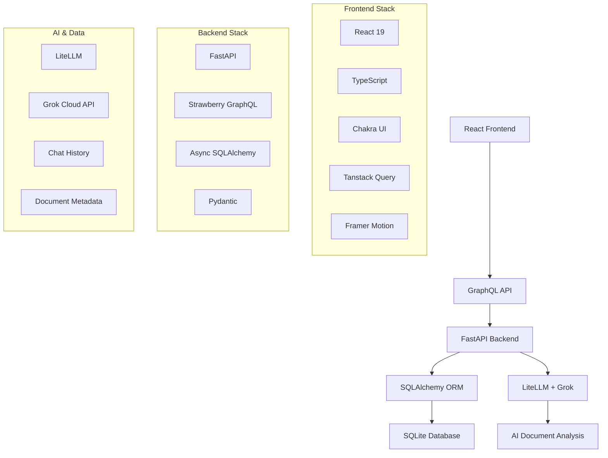

# 🔍 Hebbia Matrix Practice - Full-Stack Financial Analysis Platform

<div align="center">
  
  
  <p><em>A sophisticated full-stack application mimicking Hebbia's Matrix platform for financial document analysis and AI-powered research</em></p>

  
  
  
  
  
  
</div>

---

## 🎯 **Project Overview**

This project is a comprehensive full-stack application designed to replicate the core functionality of Hebbia's Matrix platform. It combines modern web technologies with AI-powered document analysis to create an intuitive financial research and analysis tool.

### **What is Hebbia Matrix?**
Hebbia Matrix is a revolutionary AI-powered platform that enables financial professionals to analyze documents, extract insights, and conduct research through natural language interactions. This practice implementation focuses on:

- **Document Management**: Upload, organize, and analyze financial documents
- **AI-Powered Chat**: Interactive conversations with documents using LLM integration
- **Data Visualization**: Matrix-style data presentation and analysis
- **Real-time Collaboration**: Multi-user document analysis capabilities

---

## 🏗️ **Architecture**



---

## ✨ **Key Features**

### 🤖 **AI-Powered Analysis**
- **Intelligent Document Processing**: Upload and analyze financial documents using Grok AI
- **Natural Language Queries**: Ask questions about your documents in plain English
- **Contextual Responses**: Get detailed insights based on document content
- **Conversation History**: Persistent chat sessions with threading support

### 📊 **Matrix Interface**
- **Document Grid View**: Organize documents in a familiar matrix layout
- **Advanced Filtering**: Search and filter by document type, date, and metadata
- **Column Customization**: Add custom analysis columns for investment risks, market considerations
- **Drag & Drop**: Intuitive file upload and organization

### 🔄 **Real-time Features**
- **Live Chat**: Real-time AI responses with typing indicators
- **Document Updates**: Instant synchronization across sessions
- **Status Monitoring**: Real-time system status and AI agent availability

### 🎨 **Modern UI/UX**
- **Responsive Design**: Optimized for desktop and mobile experiences
- **Dark/Light Themes**: Customizable interface themes
- **Smooth Animations**: Framer Motion powered transitions
- **Accessibility**: WCAG compliant interface design

---

## 🛠️ **Technology Stack**

<table>
<tr>
<td>

### **Frontend**
- **Framework**: React 19.1+ with TypeScript
- **Styling**: Chakra UI + Emotion
- **State Management**: Tanstack Query
- **Animations**: Framer Motion
- **GraphQL**: GraphQL Request
- **Build Tool**: Vite
- **Code Quality**: ESLint + Prettier

</td>
<td>

### **Backend**
- **API Framework**: FastAPI 0.115+
- **GraphQL**: Strawberry GraphQL
- **Database**: SQLAlchemy + SQLite
- **AI Integration**: LiteLLM + Grok
- **Async Support**: AsyncIO + Uvicorn
- **Data Validation**: Pydantic
- **Package Management**: Poetry

</td>
</tr>
</table>

---

## 🚀 **Quick Start**

### **Prerequisites**
- Python 3.11+
- Node.js 18+
- Poetry (Python package manager)
- Grok API key from [x.ai](https://x.ai)

### **1. Clone & Setup**
```bash
git clone <your-repo-url>
cd fullstack-practice
```

### **2. Backend Setup**
```bash
cd backend

# Install dependencies
poetry install

# Configure AI integration
./setup_llm.sh
# Add your Grok API key to .env file

# Setup database
python setup_database.py

# Test AI integration
python test_llm_integration.py

# Start development server
poetry run uvicorn app.main:app --reload --host 0.0.0.0 --port 8000
```

### **3. Frontend Setup**
```bash
cd frontend

# Install dependencies
npm install

# Generate GraphQL types
npm run generate

# Start development server
npm run dev
```

### **4. Access the Application**
- **Frontend**: http://localhost:5173
- **Backend API**: http://localhost:8000
- **GraphQL Playground**: http://localhost:8000/graphql

---

## 📁 **Project Structure**

```
fullstack-practice/
├── 📁 backend/                 # FastAPI + GraphQL Backend
│   ├── 📁 app/
│   │   ├── 📁 api/             # GraphQL schema & routes
│   │   ├── 📁 core/            # Configuration & database
│   │   ├── 📁 models/          # SQLAlchemy models
│   │   ├── 📁 services/        # AI & business logic
│   │   └── 📁 utils/           # Helper functions
│   ├── 📁 tests/               # Backend tests
│   ├── 🔧 pyproject.toml       # Python dependencies
│   └── 📋 README.md            # Backend documentation
│
├── 📁 frontend/                # React + TypeScript Frontend
│   ├── 📁 src/
│   │   ├── 📁 components/      # React components
│   │   ├── 📁 hooks/           # Custom React hooks
│   │   ├── 📁 graphql/         # GraphQL queries
│   │   ├── 📁 styles/          # Themes & animations
│   │   └── 📁 types/           # TypeScript definitions
│   ├── 📁 public/images/       # Static assets
│   ├── 🔧 package.json         # Node dependencies
│   └── 📋 README.md            # Frontend documentation
│
├── 🐳 docker-compose.yml       # Multi-service orchestration
└── 📋 README.md                # This file
```

---

## 🔧 **Development Workflow**

### **Backend Development**
```bash
# Run tests
poetry run pytest

# Code formatting
poetry run ruff format

# Linting
poetry run ruff check

# Database migrations
python setup_database.py
```

### **Frontend Development**
```bash
# Type checking
npm run build

# Linting
npm run lint

# GraphQL code generation
npm run generate
```

### **Docker Development**
```bash
# Start all services
docker-compose up -d

# View logs
docker-compose logs -f

# Rebuild services
docker-compose up --build
```

---

## 🤝 **Contributing**

This is a practice project, but contributions and suggestions are welcome!

1. **Fork** the repository
2. **Create** a feature branch (`git checkout -b feature/amazing-feature`)
3. **Commit** your changes (`git commit -m 'Add amazing feature'`)
4. **Push** to the branch (`git push origin feature/amazing-feature`)
5. **Open** a Pull Request

---

## 📝 **Learning Objectives**

This project serves as a comprehensive learning exercise covering:

- ✅ **Full-Stack Architecture**: React + FastAPI integration
- ✅ **Modern API Design**: GraphQL with TypeScript generation
- ✅ **AI Integration**: LLM APIs for document analysis
- ✅ **Database Design**: SQLAlchemy relationships and migrations
- ✅ **Real-time Features**: WebSocket-like interactions
- ✅ **UI/UX Design**: Modern, responsive interface design
- ✅ **DevOps Practices**: Docker containerization and deployment

---

## 📊 **Current Implementation Status**

| Feature | Status | Description |
|---------|--------|-------------|
| 🤖 AI Chat | ✅ Complete | Grok-powered document analysis |
| 📄 Document Upload | 🚧 In Progress | Drag & drop file handling |
| 🔍 Matrix View | 🚧 In Progress | Hebbia-style document grid |
| 📊 Data Visualization | 🚧 In Progress | Advanced chart components |
| 👥 Multi-user Support | 📋 Planned | Real-time collaboration |
| 🔐 Authentication | 📋 Planned | User management system |

---

## 🎓 **About This Project**

This application is developed as a learning project to understand and replicate the sophisticated document analysis capabilities of Hebbia Matrix. It demonstrates modern full-stack development practices while providing hands-on experience with:

- **Enterprise-grade Architecture**: Scalable, maintainable code structure
- **AI/ML Integration**: Practical implementation of LLM APIs
- **Modern Frontend Patterns**: React best practices and performance optimization
- **API Design**: GraphQL schema design and optimization
- **Database Modeling**: Complex relationships and efficient queries

---

<div align="center">
  <p><strong>🚀 Happy Coding! 🚀</strong></p>
  <p><em>Built with ❤️ for learning and practice</em></p>
</div>